# Try Hack me - Crack_the_hash_write_up

Write-up of the room "Crack the hash" on Tryhackme. This room is about, obviously, crack hashes. Some tasks could not be completed here because my computer does not have the processing power to crack these hashes, but it will be covered here anyway.

# Level 1

## 48bb6e862e54f2a795ffc4e541caed4d (MD5) 

Very simple, a md5 hash, in some cases we can use `hash-identifier` to indentify the hash we are working with. We can simply copy this string to a file and use john or hashcat to crack it. I'll be using `john` in the most questions in this room.

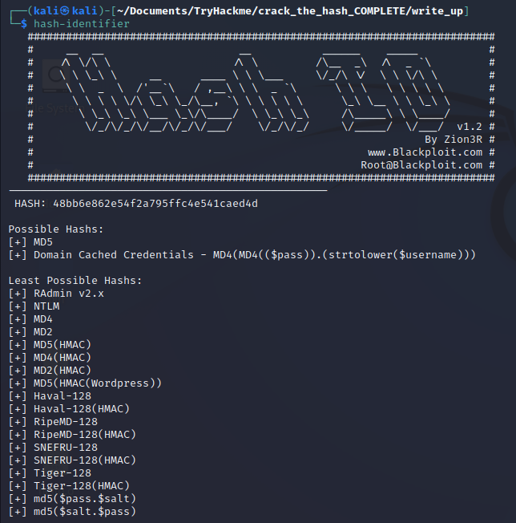
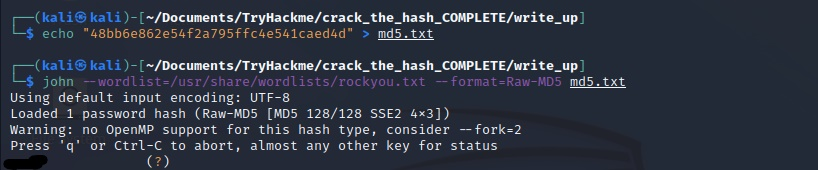

## CBFDAC6008F9CAB4083784CBD1874F76618D2A97 (SHA-1) 

Again, use `hash-identifier` to check the hash's type.

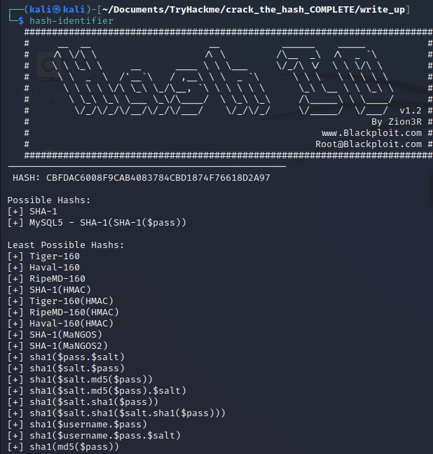
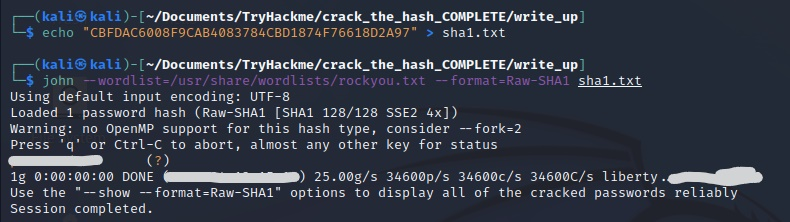

## 1C8BFE8F801D79745C4631D09FFF36C82AA37FC4CCE4FC946683D7B336B63032 (SHA-256)

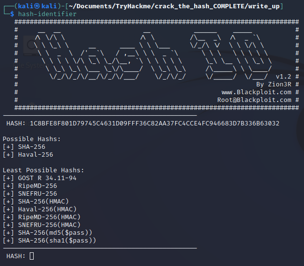
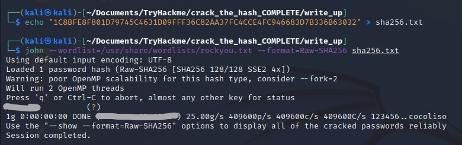

## $2y$12$Dwt1BZj6pcyc3Dy1FWZ5ieeUznr71EeNkJkUlypTsgbX1H68wsRom (???)

Note that here, `hash-identifier` can't identify the hash's type. The hint says: "Search the hashcat examples page (https://hashcat.net/wiki/doku.php?id=example_hashes) for $2y$. This type of hash can take a very long time to crack, so either filter rockyou for four character words, or use a mask for four lower case alphabetical characters."

In the [site](https://hashcat.net/wiki/doku.php?id=example_hashes) there's nothing about "$2y$", we can use https://hashes.com/en/tools/hash_identifier to check what is the hash's type.
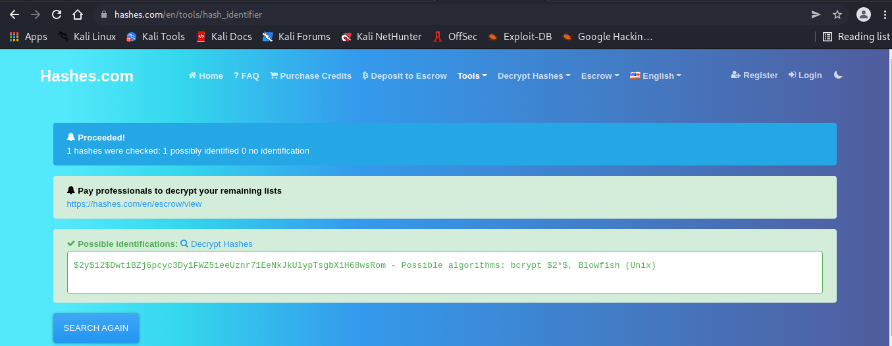

We found the "blowfish" match, searching more about blowfish crypt:

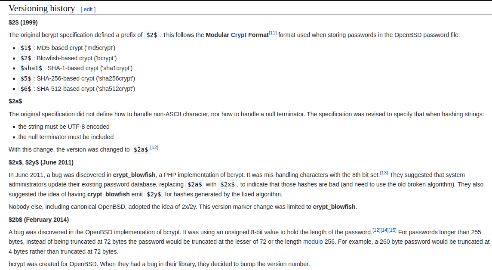

We can see that blowfish crypt has a few more versions, our version is June 2011. Going back in https://hashcat.net/wiki/doku.php?id=example_hashes we can search for the first version of bcrypt (`$2a$`) and it'll show the format of the hash. Now we can truly confirm that it's a bcrypt hash. Let's use `john` to list the formats of bcrypt. We can use the command `john --list=formats | tr , '\n' | grep -i bcrypt`.

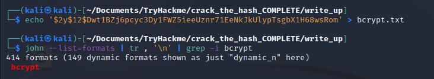

Pay attention: "so either filter rockyou for four character words, or use a mask for four lower case alphabetical characters.". We can use the command `cat /usr/share/wordlists/rockyou.txt | egrep -o '\<[a-z0-9]{4}\>' | tee four_char.txt` to get only four characters length that contain lowercase and numbers. 

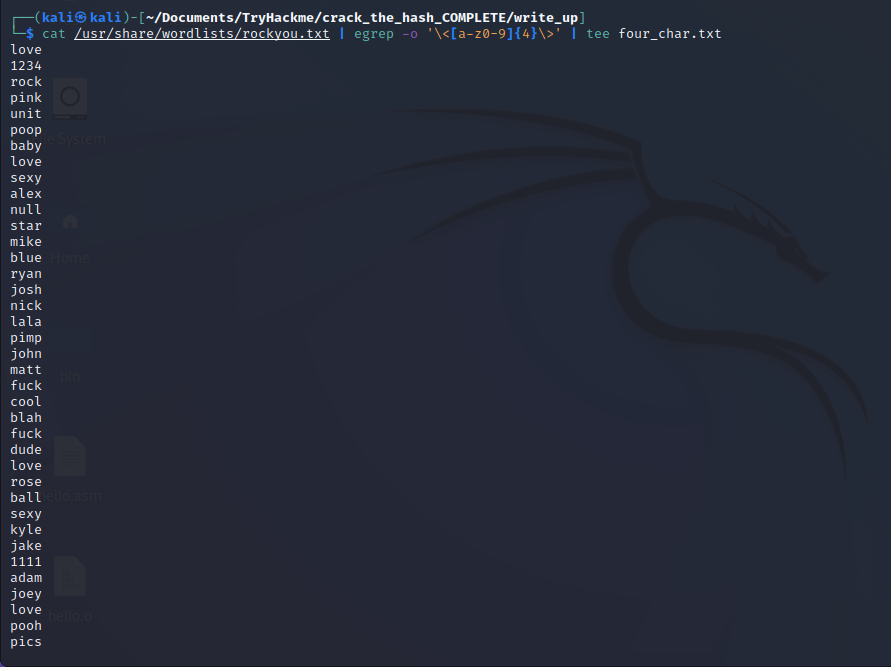

Now we can use john

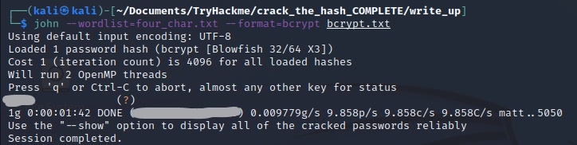

## 279412f945939ba78ce0758d3fd83daa (MD4)

In this question I used [crackstation](https://crackstation.net/), because my computer doesn't have enough processing power to crack the hash. But you can use `hashcat -m 900 md4_hash.txt /usr/share/wordlists/rockyou.txt`.

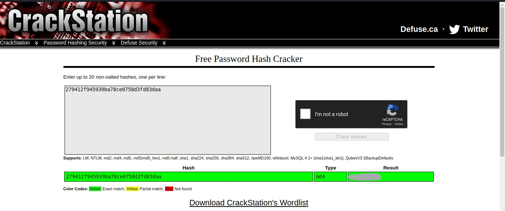

# Level 2
**This task increases the difficulty. All of the answers will be in the classic rock you password list.
You might have to start using hashcat here and not online tools. It might also be handy to look at some example hashes on hashcats page.**

## F09EDCB1FCEFC6DFB23DC3505A882655FF77375ED8AA2D1C13F640FCCC2D0C85 (SHA-256)

Same that the first SHA-256 we did.
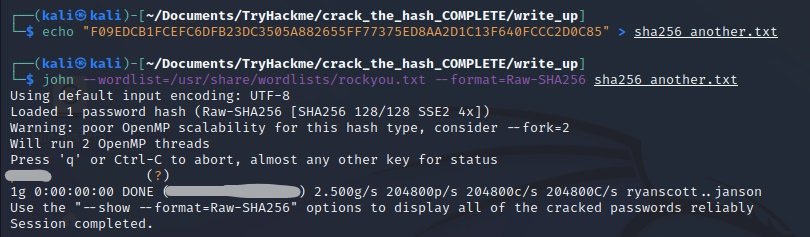

## 1DFECA0C002AE40B8619ECF94819CC1B

If we use john we need do some research, the hint says: "NTLM". I search for "NTLM" on google and came across a [medium](https://medium.com/@petergombos/lm-ntlm-net-ntlmv2-oh-my-a9b235c58ed4) blog saying about "LM,NTLM,Net-NTLMv2". Checking the hashes we can see that one who matches with our, and the command syntax.

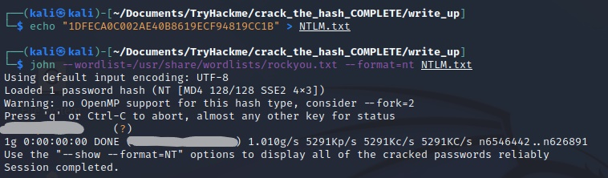

## $6$aReallyHardSalt$6WKUTqzq.UQQmrm0p/T7MPpMbGNnzXPMAXi4bJMl9be.cfi3/qxIf.hsGpS41BqMhSrHVXgMpdjS6xeKZAs02. // Salt: aReallyHardSalt -- (SHA-512)

As I said, the last two question i could not crack because of my computer, but you can use `hashcat -m 1800 sha512.hash /usr/share/wordlists/rockyou.txt`

## e5d8870e5bdd26602cab8dbe07a942c8669e56d6 // Salt: tryhackme -- (SHA-1)

You can use `hashcat -m 110 sha1.hash /usr/share/wordlists/rockyou.txt`

That's it! One more room completed.

## References:
https://hashcat.net/wiki/doku.php?id=example_hashes

https://hashes.com/en/tools/hash_identifier

https://medium.com/@petergombos/lm-ntlm-net-ntlmv2-oh-my-a9b235c58ed4
