# Tech_Supp0rt: 1
**Hack into the machine and investigate the target. Please allow about 5 minutes for the machine to fully boot!**
**Note: The theme and security warnings encountered in this room are part of the challenge**

## SMB
We can use nmap to do the initial reconnaissance. I used `nmap -sV --open $IP`. We can see that the server run a SMB server, SSH and an Web server.

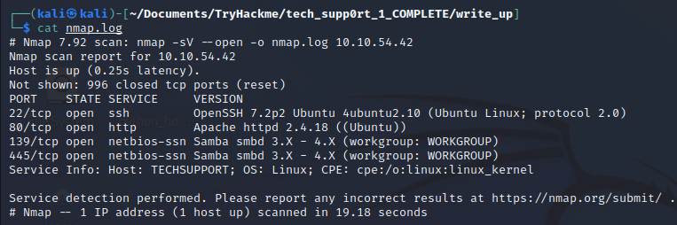

Knowing that there is a SMB server, we can list some shared files with `smbclient -N -L \\\\$IP` the `-N` option suppress password prompt, this way we can access a target which don't need a password; `-L` option is used to list the available shares on the target.

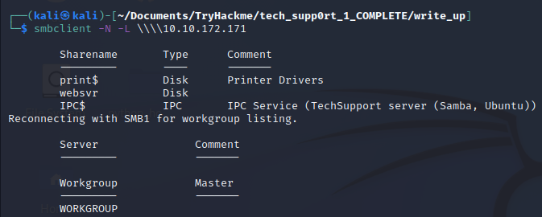

Sure! IPC$ and print$ are common on SMB servers, so let's see websvr using: `smbclient -N \\\\$IP\\websvr` now we only pass the `-N` option, just to access the share without password.
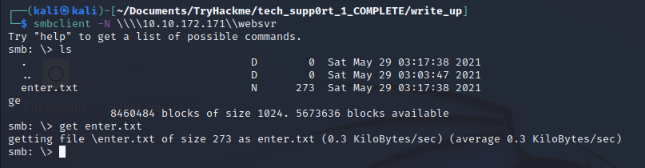

The commands on smbclient are almost the same that ftp, just `get` the file enter.txt to download to your local machine.

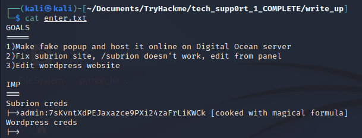

*Save these informations for later.*

## Web

Accessing the web page we see that it's a Apache default page, and there's nothing interesting on source code. So we can use `gobuster` to discover hidden directories: `gobuster dir -u http://$IP -w /usr/share/wordlists/dirb/common.txt`.

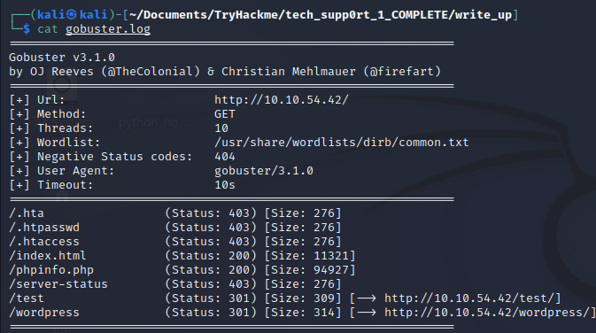

It found two hidden directories: `/wordpress` and `/test`. The /test directory is just a static page with some false pop-ups, in `/wordpress` the only thing interesting is the /wp-admin (but we probably don't will use it). We can remember what the file `enter.txt` said *"Fix subrion site, /subrion doesn't work, edit from panel"*. So we know there's a `/subrion` but it isn't working. This part i was stucked, but i remembered the basic rule of web analysis: **check the robots.txt file**. And of course there was some information.

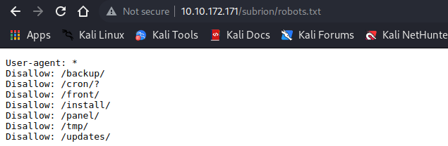

What is important is */panel* directory. We have a login page, but we already have the user and half password. If you pay attention the password is in hash format, and aside of it there's a hint for crack the password: *"Cooked with magical formula"* we can simply use [Cyberchef](https://gchq.github.io/CyberChef/) for this and apply the "magic recipe". Or you decode using this sequence: **Base58 --> Base32 --> Base64**.

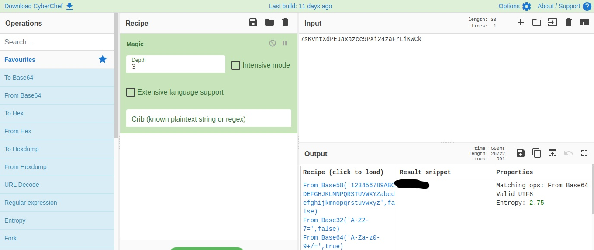

Good, now we have the user(admin) and the password, we can login in the panel. Sure, here is another part where I didn't know what to do later, but we have the admin account, we can see if there's any exploit or vulnerabilty for this CMS. We can use: `searchsploit subrion 4.2.1`.

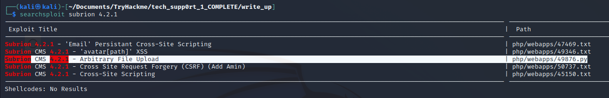

We will use the .py one. This exploit upload an exploit and give to us a RCE Shell. We just need pass the URL, User and Password, we have all.

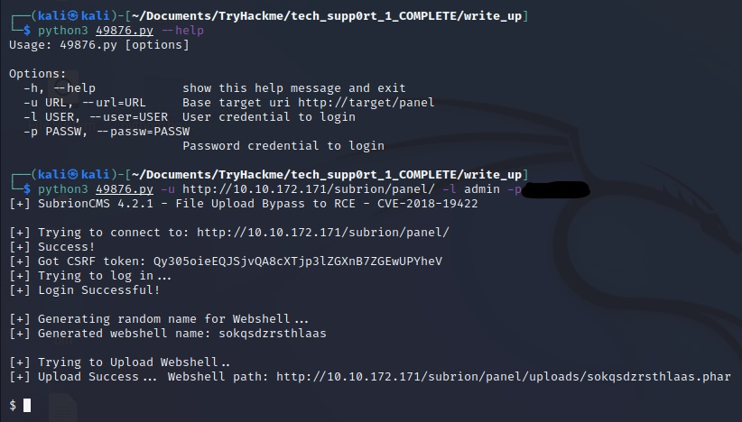

Now are in the server, but with few privileges. We can't change directory, but we can list other directories. Going straight to the point, we can check the /etc/passwd file.

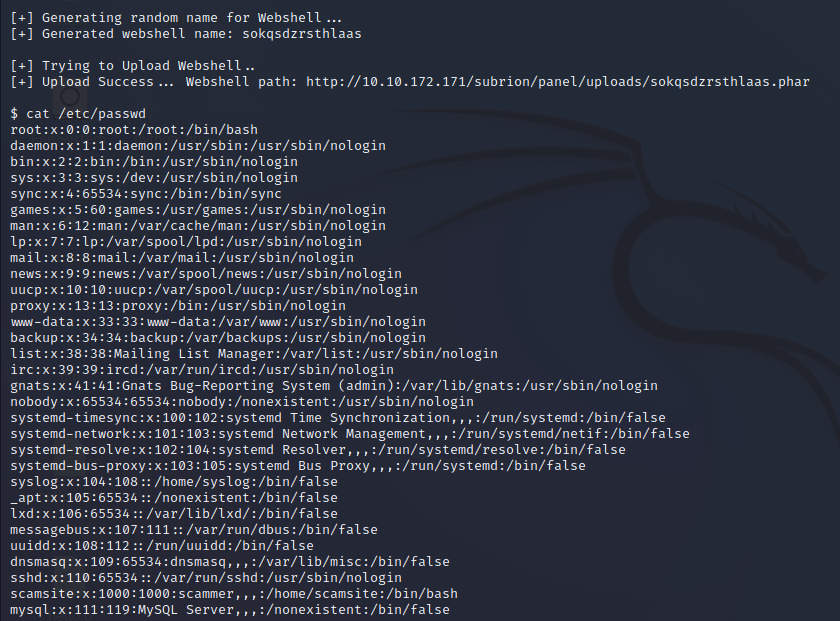

Now we know that there is a user named **scamsite**, good. We also know there's a wordpress running in the server, so the files of configuration with credentials may be visible to us. We will check the file wp-config.php.

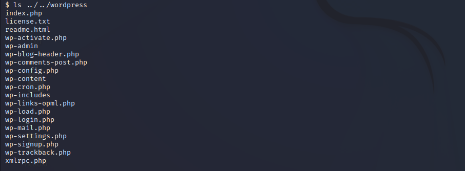

Now "cat" the file.

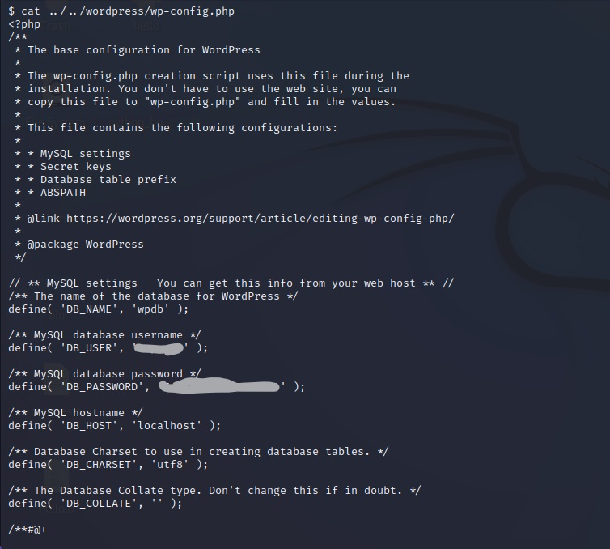

We can use these credentials on the wordpress site but i discovered that the password is the same of the user **scamsite**, so we can login via SSH. Now we are truly in.

## Privilege Escalation

The privilege escalation is very simple, we can use: `sudo -l` to check the binaries we can use with sudo and we can see that **iconv** is enable. The payload to get the flag is also simple:
```
lfile=/root/root.txt
sudo iconv -f 8859_1 -t 8859_1 "$lfile"
```

And we get the flag! Another room completed! 

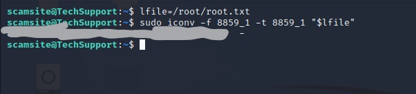
